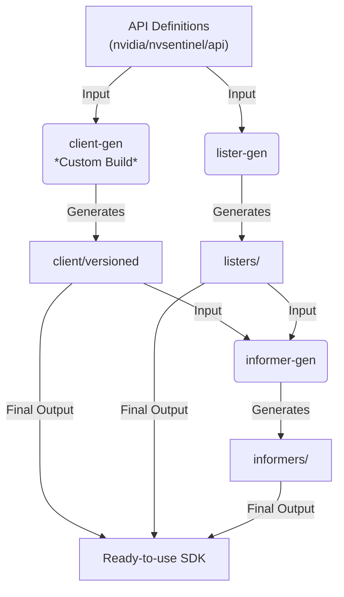

# NVIDIA Device API: Development Guide

This guide covers the development setup and workflows for contributing to the NVIDIA Device API.

## Architecture

This project bridges **gRPC** (for node-local performance) with **Kubernetes API Machinery** (for developer experience).

1. **Definitions**: `api/proto` (Wire format) and `api/device` (Go types).
2. **Conversion**: `api/device/${version}/converter.go` maps gRPC messages to K8s-style structs.
3. **Generation**: A pipeline driven by `code-generator/kube_codegen.sh`, which utilizes a modified `client-gen` to produce gRPC-backed Kubernetes clients in the `client-go` module.

---

## Code Generation Pipeline

The NVIDIA Device API uses a multi-stage pipeline to bridge gRPC with Kubernetes API machinery. For module-specific details, see the [client-go Development Guide](./client-go/DEVELOPMENT.md).



### Build Sequence

When you run `make code-gen` from the root, the following sequence is executed:

1. **Protoc**: Compiles `.proto` into Go gRPC stubs in `api/gen/`.
2. **DeepCopy**: Generates `runtime.Object` methods required for K8s compatibility.
3. **Goverter**: Generates type conversion logic between Protobuf and Go structs.
4. **Custom client-gen**: Orchestrated by `code-generator/kube_codegen.sh` to produce the versioned Clientset, Informers, and Listers in `client-go/`.

---

## Development Workflow

1. **Modify**: Edit the Protobuf definitions in `api/proto` or Go types in `api/device`.
2. **Update**: Update the conversion logic in `api/device/${version}/converter.go` to handle changes, if necessary.
3. **Generate**: Run `make code-gen` from the root. This updates the gRPC stubs, helper methods, and the `client-go` SDK.
4. **Verify**: Run `make verify-codegen` to ensure the workspace is consistent.
5. **Test**: Add tests to the affected module and run `make test` from the root.

> [!NOTE] Use the fake clients in `client-go/client/versioned/fake` for testing controllers without a real gRPC server.

---

## Code Standards & Compliance

### Commit Messages & Signing (DCO)

We follow the [Conventional Commits](https://www.conventionalcommits.org) specification. Additionally, all commits **must** be signed off to comply with the Developer Certificate of Origin (DCO).

```bash
# Example: feat, fix, docs, chore, refactor
git commit -s -m "feat: add new GPU condition type"
```

### License Headers

Every source file (.go, .proto, .sh, Makefile) must include the Apache 2.0 license header.

- **Go/Proto Template**: See `api/hack/boilerplate.go.txt`.
- **Year**: Ensure the copyright year is current.

---

## Troubleshooting

### Tooling Not Found

We use `.versions.yaml` to pin tool versions. Our Makefile attempts to use tools from your system path or download them to your Go bin directory.

- **Verify Installation**: `which protoc` or `which yq`.
- **Fix**: Ensure your `GOPATH/bin` is in your system `$PATH`:
  ```bash
  export PATH=$PATH:$(go env GOPATH)/bin
  ```

### Generated Code Out of Sync

If the build fails or `make verify-codegen` returns an error, your generated artifacts are likely stale.

```bash
# Clean all generated files across the monorepo
make clean

# Re-run the full pipeline
make code-gen
```

### Dependency Issues

If you see "module not found" or checksum errors:

```bash
# Tidy all modules
make tidy
```

---

## Getting Help

- **Issues**: [Create an issue](https://github.com/NVIDIA/device-api/issues/new)
- **Questions**: [Start a discussion](https://github.com/NVIDIA/device-api/discussions)
- **Security**: Please refer to [SECURITY](SECURITY.md) for reporting vulnerabilities.

---
