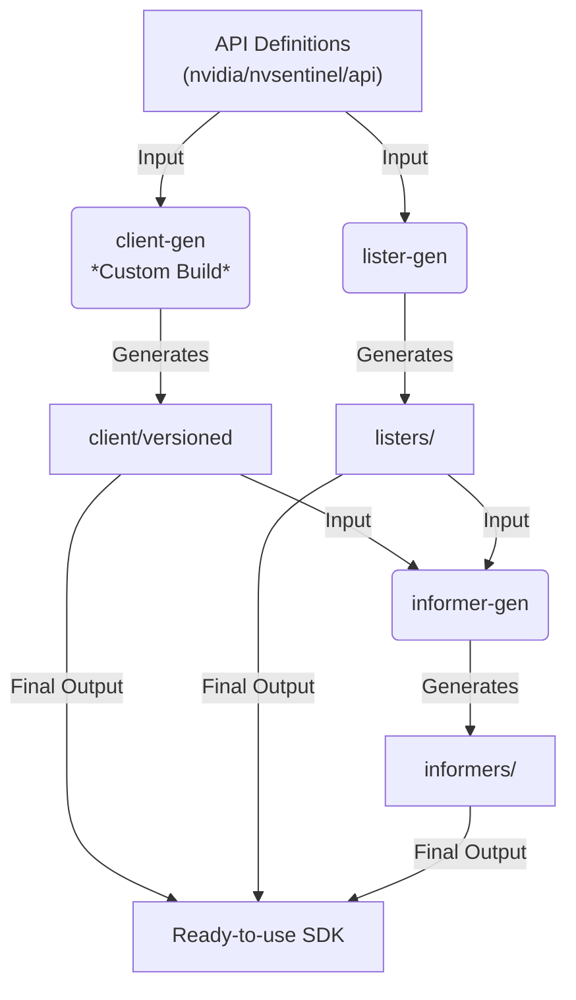

# NVIDIA Device API Go Client: Development Guide

This document outlines the workflow for developing and maintaining the NVIDIA Device API Go Client. Because this library provides Kubernetes-native interfaces, it relies heavily on **code generation**. Most of the code in this directory should not be edited manually.

## Prerequisites

* **Go**: Must match the version specified in `go.mod`.
* **Make**: Standard build tool.

## Structure

- `client/`: [Generated] The versioned Clientset. **Do not edit manually.**
- `listers/`: [Generated] Type-safe listers for cached lookups. **Do not edit manually.**
- `informers/`: [Generated] Shared Index Informers. **Do not edit manually.**
- `nvgrpc/`: [Manual] The gRPC transport layer, interceptors, and connection management logic.
- `version/`: [Manual] Version injection functionality via `ldflags`.

## Workflow

### 1. Code Generation

To (re)generate the client, run:

```bash
# Downloads codegen tools and generates clients/listers/informers
make code-gen
```

> [!TIP]
> **Did you modify the API?**
>
> If you have changed the types in the `../api` module (Proto or Go), you must run `make code-gen` **inside the API directory first**.
> This ensures that the low-level bindings (Protobufs, DeepCopy, Conversions) are up-to-date before this client attempts to generate the high-level interfaces.

### 2. Building & Testing

Verify that the generated code compiles and passes unit tests.

```bash
# Compile everything (verifies type safety of generated code)
make build

# Run unit tests (focuses on the transport layer and manual logic)
make test
```

## Code Generation Pipeline

This SDK is automatically generated from the Protocol Buffer definitions and Go types found in the `../api` module. We use standard Kubernetes code generators, including a customized build of `client-gen` to support gRPC transport.



### Components

- `client-gen` (**Customized**): Generates the **Clientset**. Our version is modified to map standard Kubernetes verbs (`Get`, `List`, `Watch`, etc.) to the node-local gRPC transport instead of REST.
- `lister-gen`: Generates **Listers**. These provide a read-only, cached view of resources, allowing for fast lookups without making network calls.
- `informer-gen`: Generates **Informers**. These coordinate the Client and Listers to watch for updates and sync the local cache.

### Modifying Generated Code

> [!WARNING]
> **Do not edit generated files directly.**
>
> Files in `client/`, `listers/`, and `informers/` contain a `DO NOT EDIT` header and are overwritten every time you run `make code-gen`.
>
> To change behavior:
>  - **API Definitions**: Modify the Proto or Go types in `../api`.
>  - **Client Logic**: Modify the templates in `../code-generator/cmd/client-gen`.
>  - **Transport & Connection**: Modify the gRPC logic in `nvgrpc`.

## Housekeeping

If your generated files are out of sync or contain stale data:

```bash
# Removes generated code (client, listers, informers)
make clean
```
