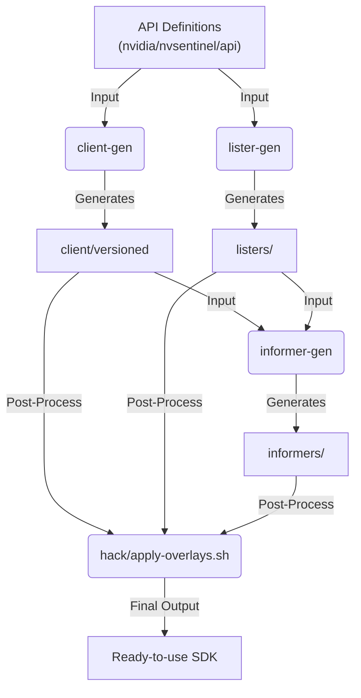

# NVIDIA Device API Go Client: Development Guide

This document outlines the workflow for developing and maintaining the `nvidia/client-go` SDK. This library relies heavily on code generation to provide Kubernetes-native interfaces (Clientsets, Listers, Informers).

## Prerequisites

* **Go**: Matches the version in `go.mod`.
* **Make**: Standard build tool.
* **yq**: Required to parse version configuration.
    * *macOS*: `brew install yq`
    * *Linux*: See [yq installation](https://github.com/mikefarah/yq)

## Workflow

### 1. Code Generation
If you modify the API definitions (in the `api` module) or the client configuration, you must regenerate the Go code.

```bash
# Downloads codegen tools, generates clients/listers/informers, and applies overlays
make code-gen
```
**Note**: This process runs `hack/apply-overlays.sh` to inject custom gRPC logic into the generated files.

> [!TIP]
> **Modified the API?**
>
> If you have changed Protocol Buffers or Go types in the `api` module, you must run `make code-gen` **inside the `api` directory first**.
> This ensures that the low-level bindings (Protobufs, DeepCopy, Conversions) are up-to-date before this client is generated.

### 2. Building & Testing
Verify that the generated code compiles and passes unit tests.

```bash
# Compile everything (verifies type safety)
make build

# Run unit tests (excludes generated code folders from coverage)
make test
```

### 3. Full Cycle
To run the complete pipeline (Generation → Test → Build) in one go:

```bash
make all
```

## Code Generation Pipeline
This SDK is automatically generated from the Protocol Buffer definitions and Go types found in the `api` module. We use the standard Kubernetes code generators with a custom post-processing step.



### Components
1. `client-gen`: Generates the **Clientset**. This provides access to the API Resources (e.g., `DeviceV1alpha1().GPUs()`) and maps standard Kubernetes verbs (Get, List, Watch) to our gRPC transport.
2. `lister-gen`: Generates **Listers**. These provide a read-only, cached view of resources, allowing for fast lookups without making network calls.
3. `informer-gen`: Generates **Informers**. These coordinate the Client and Listers to watch for updates and sync the local cache.
4. **Overlays** (`hack/apply-overlays.sh`): A custom script that patches the generated files. We use this to inject project-specific logic (like gRPC dial options) that the standard generators don't support natively.

### Modifying Generated Code
We use an "Overlay" pattern to inject custom logic into the generated clients.
- **Source**: `hack/overlays/`
- **Destination**: Root of the repo (e.g., `client/`, `listers/`, `informers/`)

The directory structure inside of `hack/overlays/` **must exactly mirror** the structure of the generated code. During the `make code-gen` process, files in `hack/overlays` are copied over the generated files, replacing them (or adding new files) at the corresponding paths.

**Example**: To customize `client/versioned/clientset.go`, you must edit `hack/overlays/client/versioned/clientset.go`.

> [!WARNING]
> **Do not edit generated files directly.**
>
> Files in `client/`, `listers/`, and `informers/` are overwritten every time you run `make code-gen`.
> Always modify the corresponding file in `hack/overlays/` and regenerate the code to apply your changes.

## Directory Structure
- `client/`: Generated Clientset. **Do not edit manually.**
- `listers/`: Generated Listers. **Do not edit manually.**
- `informers/`: Generated Informers. **Do not edit manually.**
- `nvgrpc/`: gRPC transport layer and interceptors.
- `version/`: Functionality for version injection via `ldflags`.
- `bin/`: Local build tools (downloaded automatically by Make).


## Housekeeping
If you need to reset your environment:

```bash
# Removes generated code (client, listers, informers) and coverage files
make clean

# Deep clean: removes generated code AND deletes downloaded build tools (bin/)
make purge
```
